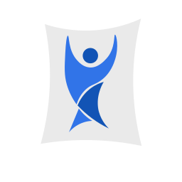

# Aarogya Patrika

[

](./assets/AshaS.png)

## About

Basically, ASHAs workers take surveys across different areas and collect information of families and on analysis they provide different Government Yojanas, financial aids and facilities to the eligible families. Currently, the information is collected on paper and data entry is done manually into excel sheets. This is time consuming and tedious procedure. Also, it becomes difficult to analyze these family’s data and take necessary actions. So, we proposed an app “Aarogya Patrika” which digitalizes whole process of data collection and analysis.

The App simplifies public administration, eliminating the need of data-entry operators. Basically, app manages to convert the data into digital format right from the point of entry, to be used, analyzed, accessed and processed across the health system by all relevant staff members. CHW (Community Health Workers) manages admin panel where they analyze the health data of families.

### [Video Demo](https://drive.google.com/file/d/1IPi3e2KOkV_28yrEoLJ4BLV0J0pk5pHu/view?usp=sharing)

## Internship Details

I have worked with Primary Health Centre Piliv Under Zilla Parishad Solapur for the position of Volunteer Software Developer form 15th April, 2020 to 15th July, 2020. I have also attached my [Internship Details](https://drive.google.com/file/d/1OXNwl5SqjxVOyzGlhEUEXSzBHJbmZUtW/view).

Since I have made this project for ASHA Workers which works for various health programs of the Government of India, I cannot share the source code of this project. 😊
