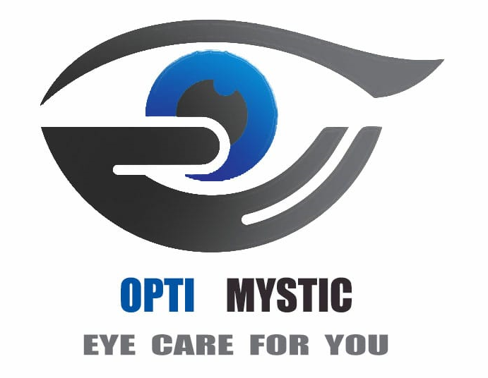

# Measure Visual Acuity

[

](./assets/opti1.png)

## About

- Visual Acuity (clearness of vision), usually measured by an eye doctor using a eye chart, is one of the most commonly applied clinical tests in the world. You have to visit eye center and then Doctor measures your visual acuity. But with this project, you don't need any ophthalmologist/doctor and one can calculate their Visual Acuity at Home.
- 2 Devices are required. 1 for Display App and another one of the remote app.
- <b>Display App</b>: In this app, there is Socket Connection which receives letters from Backend and is displayed on the screen. Then patients read those letters.
- <b>Remote App</b>: In this app, volunteer/naive user sends letter request to backend Server and then server sends that letter to Display App and Remote App.

- Patient will read the letter in Display app, and accordingly volunteer will press correct button if displayed letter is read perfectly, else wrong button is pressed. And based on inputs, Acuity score is calculated.

### [Video Demo](https://www.youtube.com/watch?v=S_eCNi3r1LA)

### [Source Code](https://github.com/Measuring-Visual-Acuity)

## Acheivements

- Winners of DEVSOC 2021 organised Vellore Institute of Technology, Vellore, Tamil Nadu where we presented Measure Visual Acuity Project.

### [Profile](https://github.com/KartikCD)
