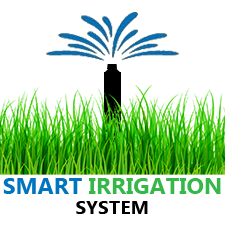
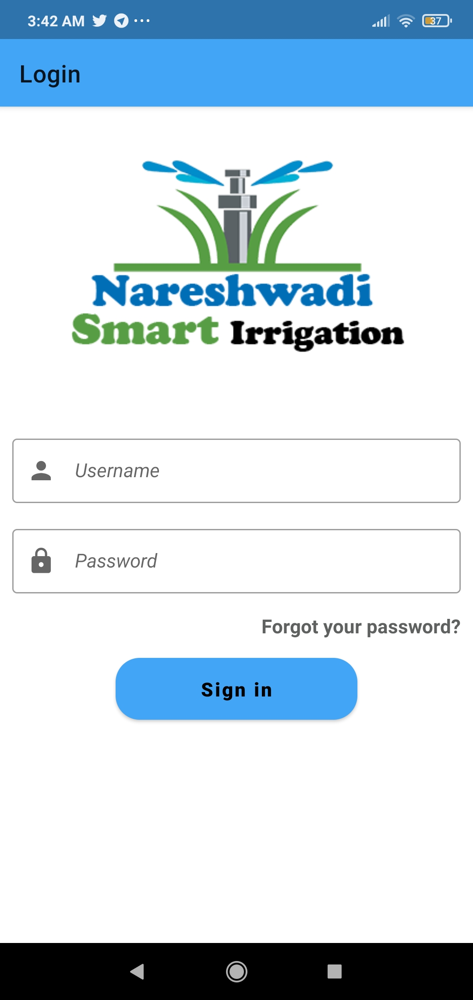
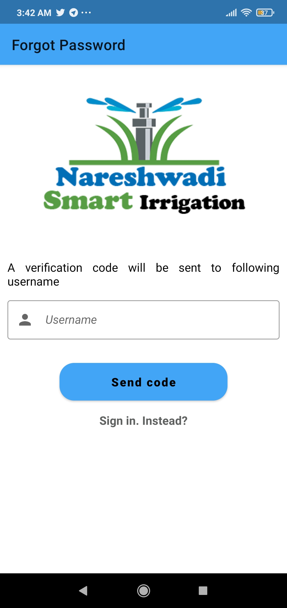
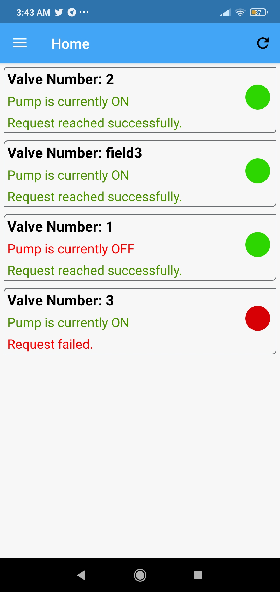
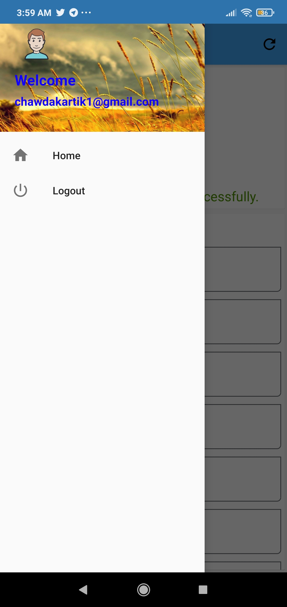
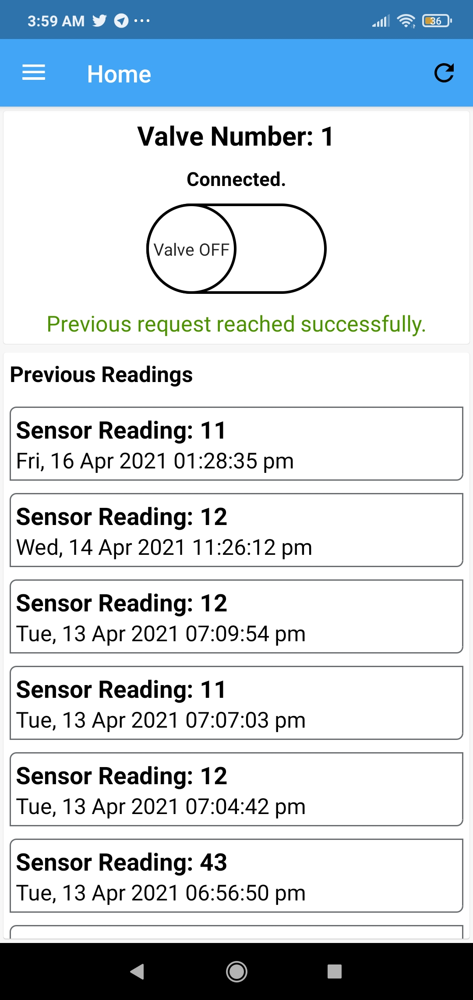

# Smart Irrigation System (SIS-App)

[

](./assets/logo.png)

## About

Nareshwadi Learning Centre has 12 acre farm where underground water supply is connected. Employees working over there manually operates water flow in the farm. They wanted to Automate the farm.

We provided Smart Irrigation System as the solution to automate the farm.

### [Video Demo](https://drive.google.com/file/d/1tkulrseDfNh6KDUKRX20MQIbVSpam_pn/view?usp=sharing)

## Screenshots

- <b>Login Screen</b> - AWS Amplify Authentication was setup with android project. On AWS Cognito Userpool we manually add users and their authentication details are mailed to respective user. 
  
  

- <b>Valve List Screen</b> - API exposing Lambda Function is called. Lambda Function is secured to the cognito userpool i.e. Without AWSAuth instance, lambda function won't execute. 
  
  

- <b>Valve ON/OFF Screen</b> - With the help of AWS Pub/Sub Messaging, pump ON/OFF request is published and valve gets ON or OFF. 
  

## Note

Since I have made this project for Nareshwadi Learning Center, I cannot share the source code of this project. 😊
