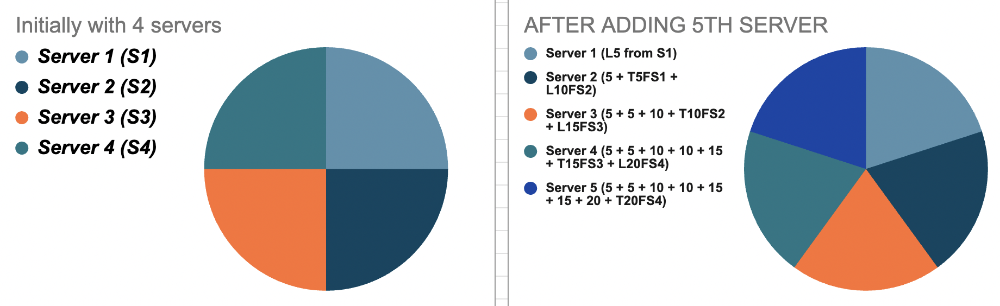
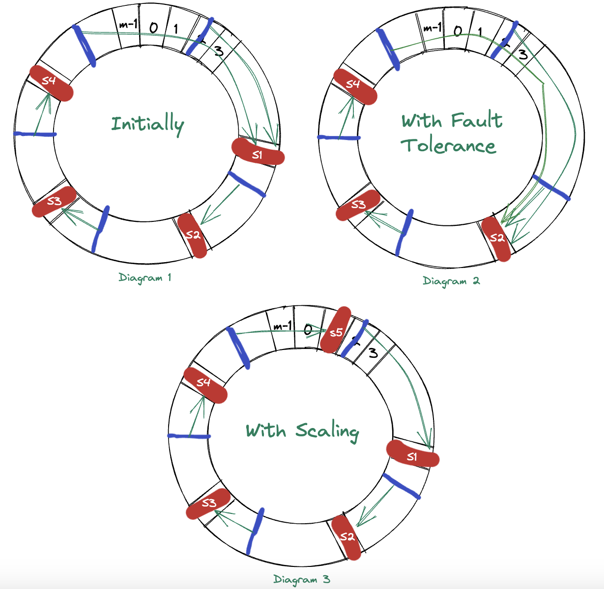

# System Architecture Important Notes

## Primer System Architecture
<b>Key Points should be considered when designing system architecture.</b>

- Vertical Scaling
- Preprocessing using cron jobs
- Backup Servers
- Horizontal Scaling
- Microservices
- Distributed Systems
- Load balancing
- Decoupling
- Logging and metrics calculation
- Extensibility

### Load Balancing
This is concept of actually taking N servers and trying to balance the load evenly on all of them is called load balancing.

To distribute the weights across all the servers the concept of consistent hashing will help us.

#### Retro way of applying load balancing algorithm
- Lets say client sends a request with some `request-id` within a range of `0 - m-1`.
```
/**
    * Lets consider "request-id" as "r1".
    * Lets consider some hash algorithm as "H()" which inturn return particular number.
    * Lets consider hash returned number as "h1"  
    * Lets assume we have "n" servers to balance out the load.
*/

const r1 = request-id

function H() {
    // some op calculation
    return h1
}

const h1 = H(r1)

// After calculation we get hash number. 

const index = h1 % n

// Based on the index route that request to 'server configured with that index number.'

For Example:
r1 = 3
n = 4 (S0, S1, S2, S3, S4)
h1 = H(3) // This returns 2
index = 2 % 5 // Result is 2

// Hence route this request to server (S2)
```

It rarely happens that `request-id` is random. It usually contains some user information or requester's information. And from the above example Hash function `H()` is constant. Which means for request-id of same user, request will be routed to the same server again and again, since result which hash function returns is constant for that user. 

Since the request is made to the same server repeatedly by same user, then its better to locally cache the response of that request inside that server.



> Note: This is old way of consistent hashing which was being practiced. This is not the ideal way because there is a huge change in buckets of multiple servers. So more advance approach needs to be used. This is where consistent hashing comes in place.

#### Consistent Hashing

Problem is not load balancing... Problem is adding and removing servers. This completely changes the local data that we have in each servers. To avoid this, we use consistent hashing algorithm.



With reference to above diagram.

1. Let us consider there are 4 servers `S1, S2, S3, S4'.

2. Now as we used to hash request based on request id. In same way we hash servers also with some hash function. And store values of server hash function in some array/db.

3. When request arrives, algorithm hash the request based on the request id and based on the hash result it searches for the nearest server in clockwise direction and sends requests to that server. as shown in <b>Fig. 1</b>

4. `In case of fault tolerance`: Refer diagram 2. In case of fault tolerance, as shown in diagram 2 the server crashed unknowingly... so the request which is S1 has been sent to nearest server which is S2.

5. `In case of scalability`: Refer diagram 3. In case of scalability, as showin in diagram 3 the new server is added `S4`. So the request hashed near that server is sent to S4 server.

6. But this was also being managed in traditional approach. Then what is the advantage of this approach. We can make use of concept called virtual server at this position.

    - We write multiple hash functions and hash servers with multiple hash function and store result of each hash function in database/array.
    - So now there are multiple serve points present in above circular belt. Based on this the load is well balanced and it is easy to scale as well.
    